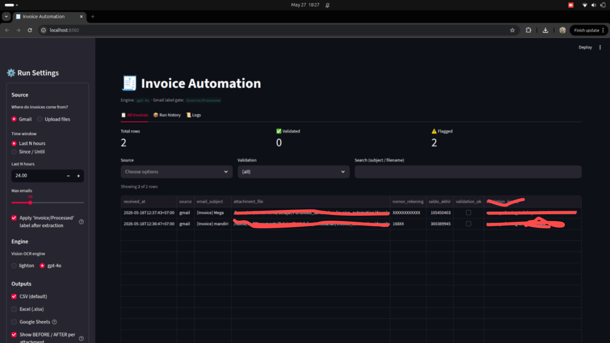
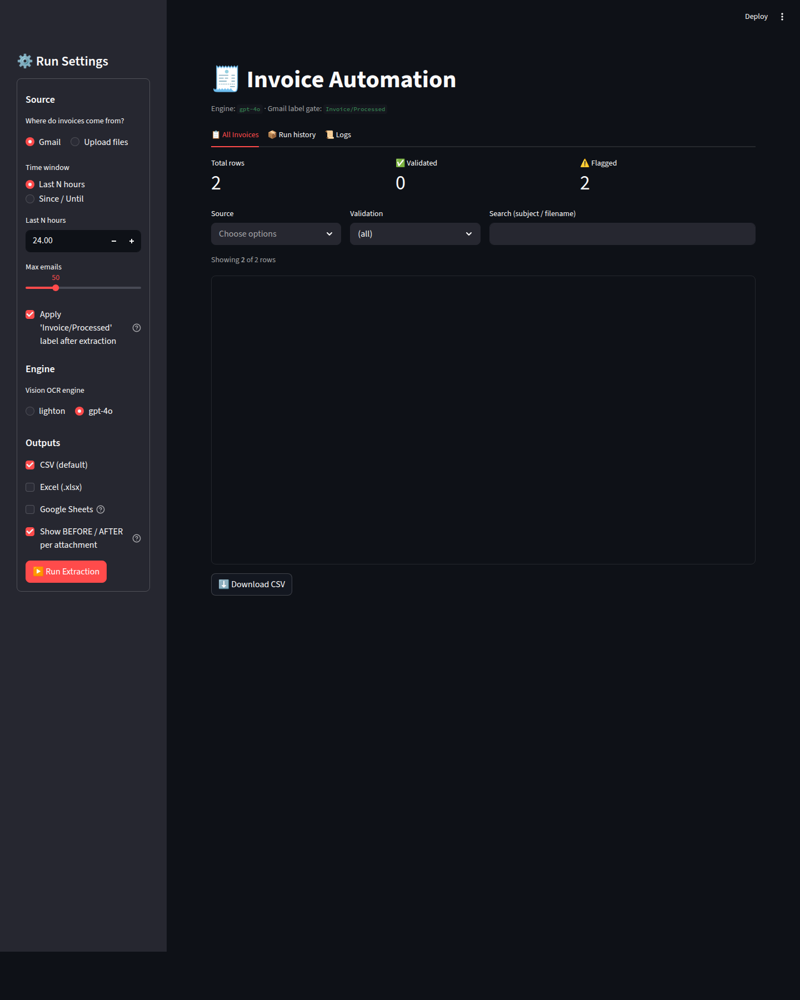

# Invoice Automation

End-to-end automation: Gmail email → classification → PDF/image render → vision OCR (LightOn OCR or GPT-4o) → validation → CSV.

## UI Preview

Streamlit UI at `http://localhost:8502` (launch with `python start.py`).

**All Invoices — extraction results table + validation flags:**



**Empty state — Run Settings sidebar (Source / Engine / Outputs):**



Per the flowchart:

```
Gmail (time_init, time_final)
        ↓
Classify + Mark as read
        ↓
Render PDF/image → PNG (PyMuPDF)
        ↓
Pick engine: LightOn OCR  OR  GPT-4o (vision)
        ↓
Validate → CSV (default)  [Excel + Google Sheet optional]
```

> **Note**: This pipeline is **image-first**. Native PDFs are rendered to PNG first rather than extracting the text layer. This ensures the chosen engine (LightOn OCR / GPT-4o) always sees the document with its own eyes.

## Structure

```
invoice_automation/
├── main.py              # orchestrator (CLI)
├── gmail_client.py      # Gmail API monitor + classify + mark read
├── pdf_to_images.py     # PDF/image → list of PNG (PyMuPDF + Pillow)
├── ai_extractor.py      # engine switch: lighton | gpt-4o  (schema = source of truth)
├── validator.py         # cross-check line items
├── csv_exporter.py      # CSV (default) — columns auto-derived from EXTRACTION_SCHEMA
├── excel_exporter.py    # openpyxl, optional (--excel)
├── sheets_exporter.py   # gspread, optional (--sheets)
├── config.py            # env loader
├── requirements.txt
├── install.sh
├── .env.example
├── credentials/         # OAuth + service-account JSON (gitignored)
├── downloads/           # attachments + rendered pages
└── output/              # CSV + JSON dump + (optional) xlsx
```

## Setup

### 1. Install Python deps

```bash
cd /home/rnd/Documents/Belajar/Portofolio_tambbahan/invoice_automation
./install.sh
```

Or manually:

```bash
/home/rnd/Documents/Belajar/Portofolio_tambbahan/venv/bin/pip install -r requirements.txt
```

> Tesseract is no longer required — OCR is handled by LightOn / GPT-4o.

### 2. Fill in `.env`

```bash
cp .env.example .env && nano .env
```

Minimum required:

```env
DEFAULT_AI_ENGINE=lighton          # or gpt-4o

# if using LightOn:
LIGHTON_API_KEY=<your key>
LIGHTON_BASE_URL=https://api.lighton.ai/v1   # or your local vLLM endpoint
LIGHTON_MODEL=lighton-ocr

# if using GPT-4o:
OPENAI_API_KEY=sk-...
OPENAI_MODEL=gpt-4o
```

### 3. Google credentials

- **Gmail OAuth client**: Google Cloud Console → APIs & Services → Credentials → Create OAuth client ID (Desktop) → save the JSON to `credentials/gmail_credentials.json`.
- The first run opens a browser for the Gmail OAuth flow; the token is stored at `credentials/gmail_token.json`.
- *(optional)* **Service Account for Sheets**: if you need `--sheets`, create a service account, place the JSON at `credentials/sheets_service_account.json`, then share the target Sheet with the service account's email.

## Usage

```bash
source /home/rnd/Documents/Belajar/Portofolio_tambbahan/venv/bin/activate

# Default: pull emails from yesterday 00:00 until now, using LightOn → write CSV
python main.py --since "2026-05-17 00:00" --until "2026-05-18 23:59" --engine lighton

# Shortcut: last 24 hours, using GPT-4o
python main.py --last-hours 24 --engine gpt-4o

# Manual fallback for files outside email (repeatable)
python main.py --file /path/to/invoice1.pdf --file /path/to/receipt.jpg

# Also write Excel
python main.py --last-hours 6 --excel

# Also write to Google Sheets (requires service account JSON + SHEET_ID in .env)
python main.py --last-hours 6 --sheets

# Testing: skip applying the processed label (emails get picked up again next run)
python main.py --last-hours 24 --no-mark-processed
```

Outputs:

- `output/invoices.csv` — one row per invoice, append mode (default).
- `output/invoices.xlsx` — optional via `--excel`, flagged rows highlighted in red.
- Google Sheet — optional via `--sheets`.
- `output/run_*.json` — raw JSON dump for debugging / Loom walkthroughs.
- `downloads/pages/` — per-page PNG renders (useful when debugging).
- `logs/run.log` — per-run log.

## CSV columns (auto-derived)

Columns are pulled automatically from `EXTRACTION_SCHEMA` in [ai_extractor.py](ai_extractor.py#L17). Add or remove a field in that dict — the AI prompt **and** CSV columns follow automatically.

Current order:

1. **Metadata**: `received_at`, `source` (gmail/manual), `email_subject`, `attachment_file`
2. **From AI**: `vendor_name`, `invoice_number`, `invoice_date`, `due_date`, `subtotal`, `tax`, `total`, `currency`, `payment_terms`
3. **Derived**: `line_items_json`, `line_items_count`, `validation_ok`, `validation_issues`

## Validation

A row is automatically flagged when:

- A required field is missing (`vendor_name`, `invoice_number`, `invoice_date`, `total`)
- Σ `quantity × unit_price` per line ≠ `amount`
- Σ line items ≠ `subtotal`
- `subtotal + tax` ≠ `total`

Tolerance: 0.02 (rounding).

## Engine notes

| Engine | API spec | Use when... |
|---|---|---|
| **lighton** | OpenAI-compatible (`/v1/chat/completions`) | Using the LightOn cloud service, or self-hosting LightOnOCR-1B via vLLM |
| **gpt-4o** | OpenAI native | High accuracy out of the box, requires OpenAI credit |

**Email classification**: only emails whose subject **contains `[Invoice]`** (anywhere — start, middle, or end; case-insensitive) + has an attachment + is unread + does **not** yet have the `Invoice/Processed` label. This filter is pushed into the Gmail query so it runs server-side and stays fast. Edit `INVOICE_SUBJECT_MARKER` in [gmail_client.py](gmail_client.py) if you want to change the marker.

**Processed tracking**: After a successful extraction, the pipeline applies the Gmail label **`Invoice/Processed`** to the email. The email **stays UNREAD** (so your team can still review it manually in the inbox), but subsequent runs skip it automatically. Need to reprocess? Remove the `Invoice/Processed` label in the Gmail UI.
